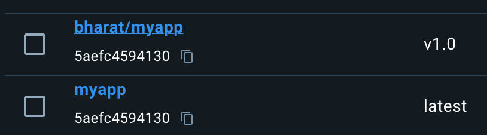
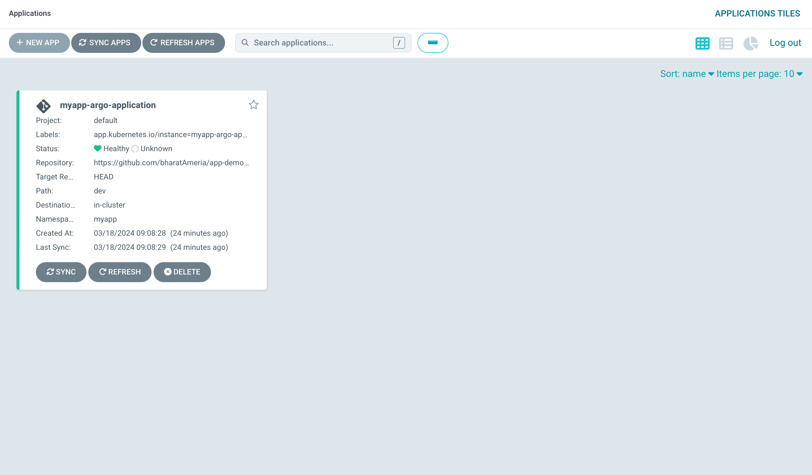
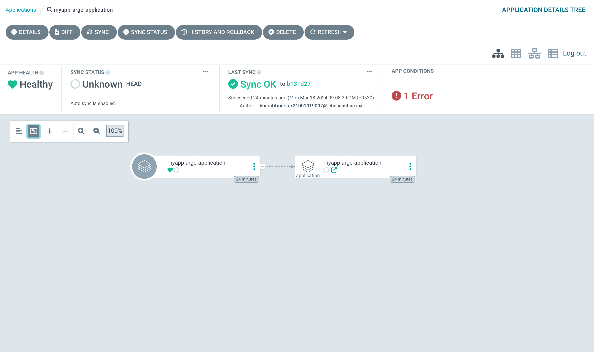
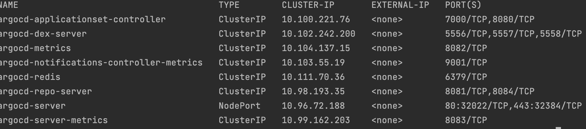

## GitOps Pipeline with Argo CD and Argo Rollouts

# Introduction
This repository contains the code and documentation for setting up a GitOps pipeline using Argo CD and implementing a Canary Release strategy with Argo Rollouts on Kubernetes.
In this demo I created a simple html file.

# Steps to setup the pipeline
1. step 1:- Create a index.html file
2. step 2:- Create a Dockerfile for making the image of the project
3. step 3:- Now make teh Argo CD and Argo Rollouts configuration files
4. step 4:- Install the Argo CD by following the official documentation
5. step 5:- Accessing the Argo CD UI page
6. step 6:- Prepare canary rollout strategy in myapp-canary.yaml file in which I create 5 replica sets of the application

## Argo CD Commands for performing the above steps
* First of all, Run the Docker Desktop in not then install
* Then install Kubernetes, Kubectl and minKube run commands
* The given below command install the Argo CD and its dependencies
kubectl create namespace argocd
kubectl apply -n argocd -f https://raw.githubusercontent.com/argoproj/argo-cd/stable/manifests/install.yaml

* After Installation run command
 kubectl get svc -n argocd 
this command give you the information of argo CD pods which are currently running on k8s

* Now run command
--> kubectl port-forward -n argocd svc/argocd-server 8080:443

which forward you to the port 127.0.0.1:8080 -> 8080

#### To accessing the Argo CD UI
Now login to Argo and configure our application to Argo CD to do that run command
 
1. kubectl apply -f application.yaml
2. kubectl apply -f deployment.yaml 
3. kubectl apply -f service.yaml

which create a application in the argo cd ui and show all the services and dependencies
of the application including rollout strategy(in our case it is canary) and replicas 

